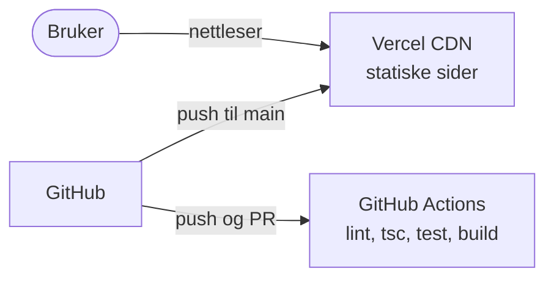
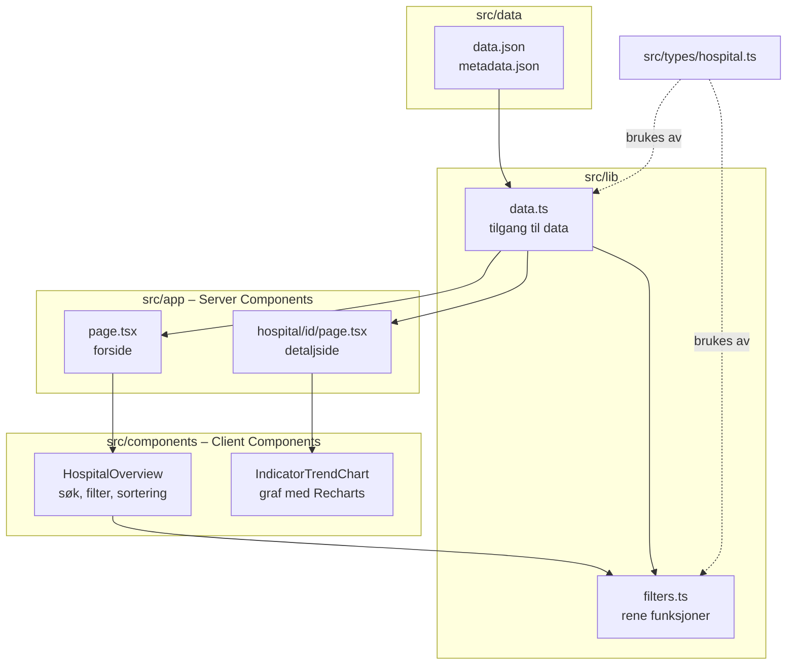
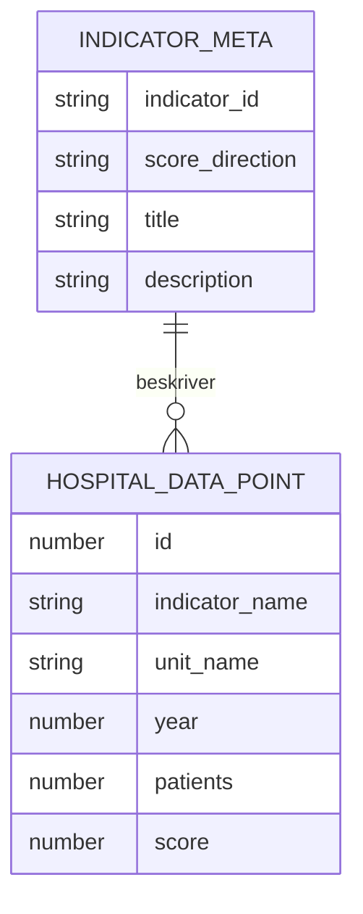

# Helse-kvalitet-dashboard – Arkitektur

Dette dokumentet beskriver hvordan dashboardet er bygget, og hvorfor. Det er ment for utviklere som vil forstå systemet før de leser koden.

## 1. Kontekst og mål

Dashboardet viser kvalitetsdata fra Tonsilleregisteret. Brukeren kan sammenligne helseforetak og se utviklingen over flere år.

**Mål**
- Gjøre tallene lette å sammenligne og tolke riktig, blant annet ved å vise antall pasienter.
- Rask lasting uten egen server eller database.
- Filtreringslogikken skal kunne testes uten nettleser.
- Systemet skal kunne driftes gratis.

**Utenfor omfang**
- Innlogging og brukerdata.
- Automatisk henting av nye tall fra registeret.

## 2. Krav

| Type | Krav |
|---|---|
| Funksjonelt | Søk etter helseforetak |
| Funksjonelt | Filtrer på år og kvalitetsindikator |
| Funksjonelt | Sorter etter resultat, høyest eller lavest først |
| Funksjonelt | Detaljside per helseforetak med utvikling over tid |
| Funksjonelt | Antall pasienter vises sammen med resultatet |
| Ikke-funksjonelt | Alle sider bygges på forhånd (statisk) |
| Ikke-funksjonelt | Typesikre data med TypeScript |
| Ikke-funksjonelt | CI kjører lint, typesjekk, tester og bygg på hver push |

## 3. Systemkontekst

Det finnes ingen server som kjører ved hver forespørsel. Vercel bygger appen når `main` endres og leverer ferdige HTML-sider fra CDN.

## 4. Komponenter og lag

| Del | Ansvar |
|---|---|
| **data/** | Rådata som JSON: datapunkter og beskrivelse av indikatorene |
| **lib/data.ts** | Eneste sted som leser JSON-filene. Gir typede funksjoner som `getAllData`, `getIndicators`, `getAvailableYears` og `getHospitalNames` |
| **lib/filters.ts** | Rene funksjoner for søk, filtrering og sortering. Ingen React, så de er enkle å teste |
| **app/** | Sider og ruter. Kjører ved bygging og lager ferdig HTML |
| **components/** | Interaktive deler som kjører i nettleseren |
| **types/** | Felles datatyper |

## 5. Dataflyt

**Ved bygging**
1. `lib/data.ts` importerer JSON-filene.
2. `generateStaticParams` lager én detaljside per helseforetak.
3. Next.js skriver ut ferdig HTML for forsiden og alle detaljsidene.

**I nettleseren**
1. Brukeren søker, filtrerer eller sorterer.
2. `HospitalOverview` kaller funksjonene i `lib/filters.ts`.
3. Listen oppdateres umiddelbart uten nye kall til en server.

`dynamicParams = false` gjør at ukjente helseforetak i URL-en gir 404 i stedet for en tom side.

## 6. Datamodell

Hvert datapunkt er ett resultat for ett helseforetak, én indikator og ett år. `indicator_name` peker på `indicator_id` i metadataene. `patients` vises alltid sammen med `score`, fordi et resultat basert på få pasienter er mindre sikkert.

Metadataene angir også `score_direction`: lavere score er ønskelig for reinnleggelse og kontakt på grunn av smerter, mens høyere score er ønskelig for symptomfrihet. Oversikten bruker denne retningen som standardsortering når indikatoren endres.

## 7. Designbeslutninger

**ADR-1: Statisk side i stedet for server og database**
- *Valg:* Alle sider bygges på forhånd fra JSON.
- *Alternativ:* API og database.
- *Hvorfor:* Dataene endres sjelden. Statiske sider er raske, billige og har færre ting som kan gå galt.

**ADR-2: Rene funksjoner for filtrering**
- *Valg:* All filtrering og sortering ligger i `lib/filters.ts`, utenfor komponentene.
- *Alternativ:* Logikk direkte i React-komponentene.
- *Hvorfor:* Funksjonene kan testes isolert, og komponentene blir enklere å lese.

**ADR-3: Server Components som standard**
- *Valg:* Bare de interaktive delene er Client Components.
- *Alternativ:* Hele appen på klienten.
- *Hvorfor:* Mindre JavaScript sendes til nettleseren, og sidene vises raskere.

**ADR-4: Én datatilgang (`lib/data.ts`)**
- *Valg:* Sidene leser aldri JSON direkte.
- *Alternativ:* Importere JSON der den trengs.
- *Hvorfor:* Hvis dataene senere skal hentes fra et API, må bare én fil endres.

**ADR-5: Vercel for drift**
- *Valg:* Vercel bygger og publiserer automatisk fra `main`.
- *Alternativ:* Egen server eller annen plattform.
- *Hvorfor:* Laget for Next.js, gratis for slike prosjekter, og uten kaldstart for statiske sider.

## 8. Testing og CI

- **Enhetstester:** Vitest tester funksjonene i `lib/filters.ts`, blant annet søk, filtrering, sortering og at sorteringen ikke endrer originaldataene.
- **CI:** GitHub Actions kjører lint, `tsc --noEmit`, tester og produksjonsbygg på hver push og pull request.

## 9. Begrensninger og videre arbeid

- **Manuell dataoppdatering:** Nye tall krever at JSON-filene oppdateres og appen bygges på nytt.
- **Ingen komponenttester:** Testene dekker logikken, men ikke selve visningen. Neste steg er tester med Testing Library.
- **Navn i URL:** Detaljsidene bruker helseforetakets navn som ID. En kort, fast ID ville gitt penere og mer stabile lenker.
- **Én kilde:** Dashboardet viser bare Tonsilleregisteret. Strukturen i `lib/data.ts` gjør det mulig å legge til flere registre.
